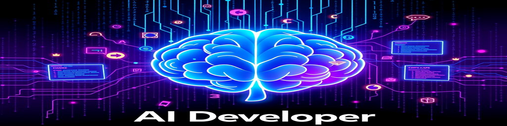

# Hi, I'm Muhammed Uyğur 

I'm a passionate AI developer focused on building intelligent deep learning and modern machine learning solutions from Türkiye. I love working with cutting-edge technologies and creating production-ready AI applications.

---

## 🔭 Currently Working On
- **AI Agent Tools** - Building intelligent automation solutions
- **Learning**: A2A (Agent-to-Agent) & MCP (Model Context Protocol)

---

## 🛠️ Tech Stack

### **Languages**

### **Backend**

### **AI/ML**

### **Databases**

### **Tools & Other**

### **Deep Learning & AI Specializations**
- **🤖 Large Language Models (LLM)**
- **🔤 Natural Language Processing (NLP)**
- **🖼️ Convolutional Neural Networks (CNN)**
- **🔍 Retrieval-Augmented Generation (RAG)**
- **⚡ LoRA & QLoRA Fine-tuning**
- **🦜 LangChain & LangGraph**
- **🤝 Agent-to-Agent (A2A)**
- **🔌 Model Context Protocol (MCP)**
- **🧠 AI Agent Development**

---

## 📈 GitHub Stats

---

## 🌱 What I'm Learning
- Advanced Agent-to-Agent (A2A) communication patterns
- Model Context Protocol (MCP) implementations

---

## 📫 Let's Connect
- Feel free to reach out for collaborations on AI projects!
- Always excited to discuss AI, machine learning, and intelligent systems
- 📧 Email: uygurmuhammed9@icloud.com  
- 💼 Linkedin: [Bağlantı](https://www.linkedin.com/in/muhammeduygur)
  

